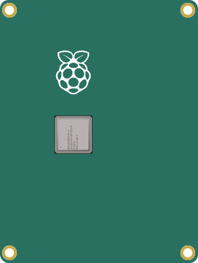

# gpio-pin-select [](https://badge.fury.io/js/@filippoitaliano%2Fgpio-pin-select) 

JavaScript component to select gpio pins with an interface.



## Usage

1. Copy `GpioPinSelect.js`, `radio.svg`, `radio-checked.svg`, `default-background.svg`, and `gpio-pin-select.css` in your own project.
2. Import the component and the styles in your index file:
    ```html
    <head>
      <script src="GpioPinSelect.js"></script>
      <!-- ... -->
    ```
3. Use the component in your script:
    ```js
    const mySelect = new GpioPinSelect(properties);
    // ...
    mySelect.destroy();
    ```

Open the `example.html` file in a browser to see a quick demo.

---

## Properties

| Property          | Description                                         | Required | Default             |
| ----------------- | --------------------------------------------------- | -------- | ------------------- |
| parentNode        | The **div** in which the component will be appended | ✔       |                     |
| onSelectionChange | The callback called upon radios selection           |          | `console.log`       |
| mapping           | Alternative mapping for pins position               |          | The default mapping |

---

## Default mapping:

| Position | Name  |
| -------- | ----- |
| 1        | 3V3   |
| 2        | GP2   |
| 3        | GP3   |
| 4        | GP4   |
| 5        | GND   |
| 6        | GP17  |
| 7        | GP27  |
| 8        | GP22  |
| 9        | 3V3   |
| 10       | GP10  |
| 11       | GP9   |
| 12       | GP11  |
| 13       | GND   |
| 14       | ID_SD |
| 15       | GP5   |
| 16       | GP6   |
| 17       | G13   |
| 18       | GP19  |
| 19       | GP26  |
| 20       | GND   |
| 21       | 5V    |
| 22       | 5V    |
| 23       | GND   |
| 24       | GP14  |
| 25       | GP15  |
| 26       | GP18  |
| 27       | GND   |
| 28       | GP23  |
| 29       | GP24  |
| 30       | GND   |
| 31       | GP25  |
| 32       | GP8   |
| 33       | GP7   |
| 34       | ID_SC |
| 35       | GND   |
| 36       | GP12  |
| 37       | GND   |
| 38       | GP16  |
| 39       | GP20  |
| 40       | GP21  |
